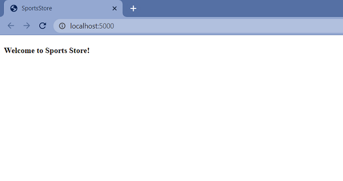
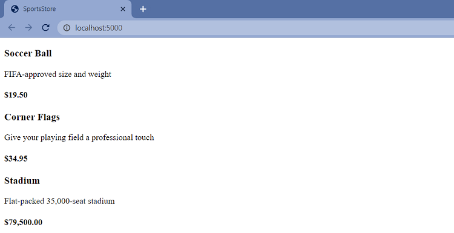
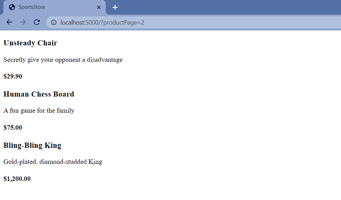
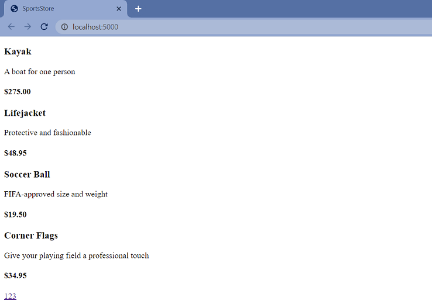
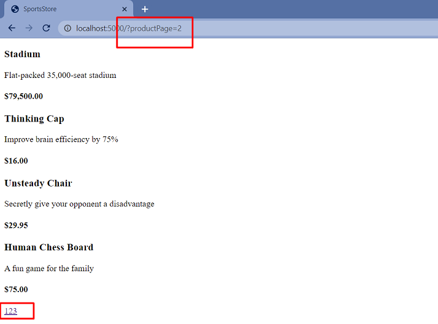
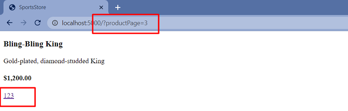
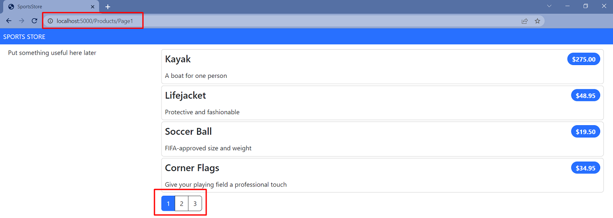
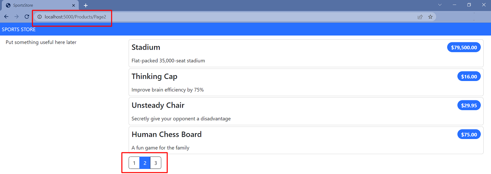

# Sports Store Application. Step 2

## Description

- Definition of a simple domain model with a product repository supported by SQL Server and Entity Framework Core.
- Development of the `HomeController` controller that can create paginated product lists.
- Setting up clean and friendly URL schemes.
- Styling of the content.

## Prerequisites

Before starting this step, ensure you have:
- .NET 8 SDK installed
- **Database Provider Options:**
  - **Windows**: SQL Server LocalDB or SQL Server Express
  - **macOS/Linux**: SQLite (included with .NET 8) or PostgreSQL
- Visual Studio 2022, Visual Studio Code, or any IDE supporting .NET 8
- Git for version control

## Implementation details

<details>
<summary>

**Adding Data to the Application**

</summary>

- Go to the cloned repository from the previous step `Sports Store Application. Step 1`.

- Switch to the `step-2` branch and do a fast-forward merge according to changes from the `main` branch.

```bash
$ git checkout step-2

$ git merge main --ff

```
- Continue your work in Visual Studio or other IDE.

- Build the project, run application and request http://localhost:5001/. All functionalities implemented in the previous step should work.



- Add the `Product` class in the `Product.cs` file to the `SportsStore/Models` folder. Import the required dependencies.
```csharp
using System.ComponentModel.DataAnnotations.Schema;

namespace SportsStore.Models;

// NEW: Add Product class
public class Product
{
    public long ProductId { get; init; }
    public string Name { get; set; } = string.Empty;

    public string Description { get; init; } = string.Empty;

    [Column(TypeName = "decimal(8, 2)")]
    public decimal Price { get; set; }

    public string Category { get; init; } = string.Empty;
}

```

- To install Entity Framework Core and add database support, run these commands:

**Choose ONE option based on your operating system:**

**For Windows (SQL Server):**
```bash
$ dotnet add package Microsoft.EntityFrameworkCore.Design --version 8.0.0
$ dotnet add package Microsoft.EntityFrameworkCore.SqlServer --version 8.0.0
```

**For macOS/Linux (SQLite):**
```bash
$ dotnet add package Microsoft.EntityFrameworkCore.Design --version 8.0.0
$ dotnet add package Microsoft.EntityFrameworkCore.Sqlite --version 8.0.0
```

**Note:** Do NOT install both SQL Server and SQLite packages in the same project as this will cause dependency conflicts. Choose the package that matches your operating system.

- To install the command-line tools required to prepare and create databases for ASP.NET Core applications, run these commands (see latest [version](https://learn.microsoft.com/en-us/ef/core/what-is-new/))

```bash
$ dotnet tool uninstall --global dotnet-ef
$ dotnet tool install --global dotnet-ef --version 8.0.0
```

- To define the connection string, add the configuration setting to the `appsettings.json` file in the `SportsStore` folder:

**For Windows (SQL Server):**
```json
{
    "Logging": {
        "LogLevel": {
        "Default": "Information",
        "Microsoft": "Warning",
        "Microsoft.Hosting.Lifetime": "Information"
        }
    },
    "AllowedHosts": "*",
    "ConnectionStrings": {
        "SportsStoreConnection": "Server=(localdb)\\MSSQLLocalDB;Database=SportsStore;MultipleActiveResultSets=true"
    }
}
```

**For macOS/Linux (SQLite):**
```json
{
    "Logging": {
        "LogLevel": {
        "Default": "Information",
        "Microsoft": "Warning",
        "Microsoft.Hosting.Lifetime": "Information"
        }
    },
    "AllowedHosts": "*",
    "ConnectionStrings": {
        "SportsStoreConnection": "Data Source=sportsstore.db"
    }
}
```
- Add the `StoreDbContext` context class to the `StoreDbContext.cs` file to the `SportsStore/Models` folder.

```csharp
using Microsoft.EntityFrameworkCore;

// NEW: Add StoreDbContext class
public class StoreDbContext(DbContextOptions<StoreDbContext> options) : DbContext(options)
{
    public DbSet<Product> Products => this.Set<Product>();
}
```
- To configure Entity Framework Core, add the following code to the `Program.cs` file:

```csharp
// NEW: Add required using statements
using Microsoft.EntityFrameworkCore;
using SportsStore.Models;
using SportsStore.Models.Repository;

var builder = WebApplication.CreateBuilder(args);

builder.Services.AddControllersWithViews();

// NEW: Add DbContext service with cross-platform support
builder.Services.AddDbContext<StoreDbContext>(opts => {
    var connectionString = builder.Configuration["ConnectionStrings:SportsStoreConnection"];

    // Cross-platform database provider selection:
    // - macOS/Linux: Use SQLite (lightweight, file-based database)
    // - Windows: Use SQL Server LocalDB (full-featured database)
    // This ensures the application works on all operating systems
    if (RuntimeInformation.IsOSPlatform(OSPlatform.OSX) || RuntimeInformation.IsOSPlatform(OSPlatform.Linux))
    {
        opts.UseSqlite(connectionString ?? "Data Source=sportsstore.db");
    }
    else
    {
        // Use SQL Server on Windows
        opts.UseSqlServer(connectionString ?? "Server=(localdb)\\MSSQLLocalDB;Database=SportsStore;MultipleActiveResultSets=true");
    }
});

// NEW: Add repository service
builder.Services.AddScoped<IStoreRepository, EfStoreRepository>();

var app = builder.Build();

app.UseStaticFiles();

app.MapDefaultControllerRoute();

// NEW: Initialize database with seed data
SeedData.EnsurePopulated(app);

app.Run();
```

- Create the `IStoreRepository.cs` interface file in the `SportsStore/Models/Repository` folder.

```csharp
namespace SportsStore.Models.Repository;

public interface IStoreRepository
{
    IQueryable<Product> Products { get; }
}

```

- Create the `EFStoreRepository.cs` class file in the `SportsStore/Models/Repository` folder.

```csharp
namespace SportsStore.Models.Repository;

public class EfStoreRepository(StoreDbContext ctx) : IStoreRepository
{
    public IQueryable<Product> Products => ctx.Products;
}

```

- **Note:** The repository service is already configured in the Program.cs file above. No additional changes needed.

- Add a database migration.

```bash
$ dotnet ef migrations add Initial

```
- To populate the database and provide some sample data, add a `SeedData.cs` class file to the `Models` folder.

```csharp
using Microsoft.EntityFrameworkCore;

namespace SportsStore.Models;

public static class SeedData
{
    public static void EnsurePopulated(IApplicationBuilder app)
    {
        using var scope = app.ApplicationServices.CreateScope();
        StoreDbContext context = scope.ServiceProvider.GetRequiredService<StoreDbContext>();

        if (context.Database.ProviderName != "Microsoft.EntityFrameworkCore.InMemory" &&
            context.Database.GetPendingMigrations().Any())
        {
            context.Database.Migrate();
        }

        if (!context.Products.Any())
        {
            context.Products.AddRange(
                new Product
                {
                    Name = "Kayak",
                    Description = "A boat for one person",
                    Category = "Watersports",
                    Price = 275,
                },
                new Product
                {
                    Name = "Lifejacket",
                    Description = "Protective and fashionable",
                    Category = "Watersports",
                    Price = 48.95m,
                },
                new Product
                {
                    Name = "Soccer Ball",
                    Description = "FIFA-approved size and weight",
                    Category = "Soccer",
                    Price = 19.50m,
                },
                new Product
                {
                    Name = "Corner Flags",
                    Description = "Give your playing field a professional touch",
                    Category = "Soccer",
                    Price = 34.95m,
                },
                new Product
                {
                    Name = "Stadium",
                    Description = "Flat-packed 35,000-seat stadium",
                    Category = "Soccer",
                    Price = 79500,
                },
                new Product
                {
                    Name = "Thinking Cap",
                    Description = "Improve brain efficiency by 75%",
                    Category = "Chess",
                    Price = 16,
                },
                new Product
                {
                    Name = "Unsteady Chair",
                    Description = "Secretly give your opponent a disadvantage",
                    Category = "Chess",
                    Price = 29.95m,
                },
                new Product
                {
                    Name = "Human Chess Board",
                    Description = "A fun game for the family",
                    Category = "Chess",
                    Price = 75,
                },
                new Product
                {
                    Name = "Bling-Bling King",
                    Description = "Gold-plated, diamond-studded King",
                    Category = "Chess",
                    Price = 1200,
                }
            );

            context.SaveChanges();
        }
    }
}
```

- **Note:** The database seeding is already configured in the `Program.cs` file above. The `SeedData.EnsurePopulated(app)` call is already included.

*_If you need to reset the database, then run this command in the `SportsStore` folder:_

```bash
$ dotnet ef database drop --force --context StoreDbContext

```
- Build project, add and view changes and then commit.

```bash
$ dotnet build
$ git status
$ git add *.cs *.json *.csproj
$ git diff --staged
$ git commit -m "feat: implement data layer with Product model, EF Core DbContext and seed data"

```
</details>

<details>
<summary>

**Displaying a List of Products**

</summary>

- Change the `HomeController` controller class according to following code:

```csharp
using Microsoft.AspNetCore.Mvc;
using SportsStore.Models.Repository;

namespace SportsStore.Controllers;

public class HomeController : Controller
{
    // NEW: Add repository dependency
    private readonly IStoreRepository repository;
    // NEW: Add constructor with dependency injection
    public HomeController(IStoreRepository repository)
    {
        this.repository = repository;
    }
    // NEW: Update Index action to use repository
    public IActionResult Index() => View(repository.Products);
}
```
- Update `_ViewImports.cshtml` Razor View file in the `SportsStore/Views` folder.

```csharp
// NEW: Add models namespace
@using SportsStore.Models
@addTagHelper *, Microsoft.AspNetCore.Mvc.TagHelpers
```

- Update `Index.cshtml` Razor View file in the `SportsStore/Views/Home` folder.

```html
@model IQueryable<Product>

@foreach (var p in Model ?? Enumerable.Empty<Product>())
{
    <div>
        <h3>@p.Name</h3>
        @p.Description
        <h4>@p.Price.ToString("c")</h4>
    </div>
}
```

- Build the solution. Restart ASP.NET Core and request http://localhost:5001.



- Add and view changes and then commit.

```bash
$ git status
$ git add *.cs *.cshtml
$ git diff --staged
$ git commit -m "feat: integrate repository pattern in HomeController for product display"

```

</details>

<details>
<summary>

**Adding Pagination**

</summary>

- To add pagination, modify the `HomeController` class by adding the following code:
-
```csharp
using Microsoft.AspNetCore.Mvc;
using SportsStore.Models.Repository;
using SportsStore.Models.ViewModels;

namespace SportsStore.Controllers;

public class HomeController(IStoreRepository repository) : Controller
{
    private readonly int pageSize = 4;

    // NEW: Update Index action to support pagination
    public ViewResult Index(int productPage = 1)
        => this.View(this.repository.Products
          .OrderBy(p => p.ProductId)
          .Skip((productPage - 1) * pageSize)
          .Take(pageSize));
}
```

- Restart application and request http://localhost:5001. To view another page, append query string parameters to the end of the URL like this http://localhost:5001/?productPage=2



- Add the `PagingInfo.cs` class file to the `SportsStore/Models/ViewModels` folder.

```csharp
namespace SportsStore.Models.ViewModels;

// NEW: Add PagingInfo model for pagination
public class PagingInfo
{
    public int TotalItems { get; init; }
    public int ItemsPerPage { get; init; }
    public int CurrentPage { get; init; }
    public int TotalPages => this.ItemsPerPage == 0 ? 0 : (int)Math.Ceiling((decimal)this.TotalItems / this.ItemsPerPage);
}
```

- Create the `Infrastructure` folder in the project.

- Create the `PageLinkTagHelper` tag helper class in the `PageLinkTagHelper.cs` file in the `SportsStore/Infrastructure` folder.

```csharp
using Microsoft.AspNetCore.Mvc;
using Microsoft.AspNetCore.Mvc.Rendering;
using Microsoft.AspNetCore.Mvc.Routing;
using Microsoft.AspNetCore.Mvc.ViewFeatures;
using Microsoft.AspNetCore.Razor.TagHelpers;
using SportsStore.Models.ViewModels;

namespace SportsStore.Infrastructure;

[HtmlTargetElement("div", Attributes = "page-model")]
// NEW: Add PageLinkTagHelper for pagination links
public class PageLinkTagHelper(IUrlHelperFactory helperFactory) : TagHelper
{
    [ViewContext]
    [HtmlAttributeNotBound]
    public ViewContext? ViewContext { get; set; }
    public PagingInfo? PageModel { get; set; }
    public string? PageAction { get; set; }
    public override void Process(TagHelperContext context, TagHelperOutput output)
    {
        if (ViewContext != null && PageModel != null)
        {
            IUrlHelper urlHelper = urlHelperFactory.GetUrlHelper(ViewContext);
            TagBuilder result = new TagBuilder("div");
            for (int i = 1; i <= PageModel.TotalPages; i++)
            {
                TagBuilder tag = new TagBuilder("a");
                tag.Attributes["href"] = urlHelper.Action(PageAction,
                    new { productPage = i });
                tag.InnerHtml.Append(i.ToString());
                result.InnerHtml.AppendHtml(tag);
            }
            output.Content.AppendHtml(result.InnerHtml);
        }
    }
}

```
-  Register the `PageLinkTagHelper` tag helper in the `_ViewImports.cshtml` Razor View file in the `SportsStore/Views` folder.

```csharp
  @using SportsStore.Models
  // NEW: Add ViewModels namespace
  @using SportsStore.Models.ViewModels
  @addTagHelper *, Microsoft.AspNetCore.Mvc.TagHelpers
  // NEW: Add custom tag helpers
  @addTagHelper *, SportsStore
```

- Add a `ProductsListViewModel.cs` class file to the `Models/ViewModels` folder.

```csharp
namespace SportsStore.Models.ViewModels;

// NEW: Add ProductsListViewModel for pagination
public class ProductsListViewModel
{
    public IEnumerable<Product> Products { get; set; } = Enumerable.Empty<Product>();
    public PagingInfo PagingInfo { get; set; } = new();
}
```

- Update the `Index` action method in the `HomeController` class.

```csharp
using Microsoft.AspNetCore.Mvc;
using SportsStore.Models.Repository;
using SportsStore.Models.ViewModels;

namespace SportsStore.Controllers;

public class HomeController(IStoreRepository repository) : Controller
{
    private readonly int pageSize = 4;

    // NEW: Update Index action to return ProductsListViewModel
    public ViewResult Index(int productPage = 1)
    {
        return this.View(new ProductsListViewModel
        {
            Products = repository.Products
                .OrderBy(p => p.ProductId)
                .Skip((productPage - 1) * this.pageSize)
                .Take(this.pageSize),
            PagingInfo = new PagingInfo
            {
                CurrentPage = productPage,
                ItemsPerPage = this.pageSize,
                TotalItems = repository.Products.Count(),
            },
        });
    }
}

```
-  Update the `Index.cshtml` Razor View file as show below

```html
@model ProductsListViewModel

@foreach (var p in Model?.Products ?? Enumerable.Empty<Product>())
{
    <div>
        <h3>@p.Name</h3>
        @p.Description
        <h4>@p.Price.ToString("c", System.Globalization.CultureInfo.GetCultureInfo("en-US"))</h4>
    </div>
}

```

and then add to it an HTML element that the tag helper will process to create the page links.

```html
  @model ProductsListViewModel

  @foreach (var p in Model?.Products ?? Enumerable.Empty<Product>())
  {
      <div>
          <h3>@p.Name</h3>
          @p.Description
          <h4>@p.Price.ToString("c", System.Globalization.CultureInfo.GetCultureInfo("en-US"))</h4>
      </div>
  }

// NEW: Add pagination div with tag helper
<div page-model="@Model?.PagingInfo" page-action="Index"></div>

```
- Build project, restart application and request http://localhost:5001.







- To improve the URL (instead of using http://localhost/?productPage=2), add a new route to the `Program.cs` file that follows the pattern of composable URLs that make sense to a user: http://localhost/Products/Page2.

**Update your existing `Program.cs` file** by adding the custom route before `app.MapDefaultControllerRoute()`:

```csharp
// Add this BEFORE app.MapDefaultControllerRoute() in your existing Program.cs
app.MapControllerRoute(
    name: "pagination",
    pattern: "Products/Page{productPage:int}",
    defaults: new { Controller = "Home", action = "Index", productPage = 1 });
```

Your `Program.cs` should now look like this:
```csharp
// ... existing code ...
app.UseStaticFiles();

// NEW: Add custom route for pagination
app.MapControllerRoute(
    name: "pagination",
    pattern: "Products/Page{productPage:int}",
    defaults: new { Controller = "Home", action = "Index", productPage = 1 });

app.MapDefaultControllerRoute();

SeedData.EnsurePopulated(app);
app.Run();
```
- Add and view changes and then commit.

```bash
$ git status
$ git add *.cs *.cshtml *.csproj
$ git diff --staged
$ git commit -m "feat: implement pagination system with custom tag helper and PagingInfo ViewModel"

```

</details>

<details>
<summary>

**Styling the Content**

</summary>

- Configure the project to use the `Bootstrap` package to provide the CSS styles.

**Recommended approach: Using LibMan (Library Manager)**
This is Microsoft's recommended approach for managing client-side packages in .NET 8.

1. Install the LibMan tool:

```bash
$ dotnet tool uninstall --global Microsoft.Web.LibraryManager.Cli
$ dotnet tool install --global Microsoft.Web.LibraryManager.Cli --version 3.0.71
```

2. Run the following commands in the `SportsStore` folder:

```bash
$ libman init -p cdnjs
$ libman install bootstrap@5.3.8 -d wwwroot/lib/bootstrap
```

This will create a `libman.json` file in your project root and download `Bootstrap` files to `wwwroot/lib/bootstrap/`.

**Alternative: Using CDN (for quick setup)**
If you prefer a quicker setup, you can use Bootstrap directly from CDN by adding this line to your `_Layout.cshtml`:

```html
<link href="https://cdn.jsdelivr.net/npm/bootstrap@5.3.8/dist/css/bootstrap.min.css" rel="stylesheet">
```

**Note:** CDN approach is suitable for development, but LibMan is recommended for production applications.

- Apply `Bootstrap CSS` to the `_Layout.cshtml` Layout Razor View file to the `SportsStore/Views/Shared` folder.

**Note:** Use the path `/lib/bootstrap/css/bootstrap.min.css` if you installed Bootstrap with LibMan, or use the CDN link if you chose the CDN approach.

```html
<!DOCTYPE html>
<html>
<head>
    <meta name="viewport" content="width=device-width" />
    <title>SportsStore</title>
    <link href="/lib/bootstrap/css/bootstrap.min.css" rel="stylesheet" />
</head>
<body>
    <div class="bg-primary text-white p-2">
        <span class="navbar-brand ml-2">SPORTS STORE</span>
    </div>
    <div class="row m-1 p-1">
        <div id="categories" class="col-3">
            Put something useful here later
        </div>
        <div class="col-9">
            @RenderBody()
        </div>
    </div>
</body>
</html>
```

- Style the content in the `Index.cshtml` Razor View file in the `SportsStore/Views/Home` folder.

```html
@foreach (var p in Model?.Products ?? Enumerable.Empty<Product>())
{
    <div class="card card-outline-primary m-1 p-1">
        <div class="bg-faded p-1">
            <h4>
                @p.Name
                <span class="badge rounded-pill bg-primary text-white"
                  style="float:right">
                    <small>@p.Price.ToString("c")</small>
                </span>
            </h4>
        </div>
        <div class="card-text p-1">@p.Description</div>
    </div>
}

<div page-model="@Model?.PagingInfo" page-action="Index" page-classes-enabled="true"
     page-class="btn" page-class-normal="btn-outline-dark"
     page-class-selected="btn-primary" class="btn-group pull-right m-1">
</div>
```

- To style the buttons generated by the `PageLinkTagHelper` class, add new properties to the `PageLinkTagHelper` class in the `SportsStore/Infrastructure` folder:

```csharp
public class PageLinkTagHelper : TagHelper
{
    ...
    // NEW: Add styling properties for pagination buttons
    public bool PageClassesEnabled { get; set; } = false;

    public string PageClass { get; set; } = string.Empty;

    public string PageClassNormal { get; set; } = string.Empty;

    public string PageClassSelected { get; set; } = string.Empty;

    ...

    public override void Process(TagHelperContext context, TagHelperOutput output)
    {
        ...
            for (int i = 1; i <= PageModel.TotalPages; i++)
            {
                . . .
              // NEW: Apply CSS classes for styling
              if (PageClassesEnabled)
                {
                    tag.AddCssClass(PageClass);
                    tag.AddCssClass(i == PageModel.CurrentPage
                        ? PageClassSelected : PageClassNormal);
                }
            }
        ...
    }
}
```

- Build project, restart application and request http://localhost:5001.

**Note:** If you need Bootstrap JavaScript functionality (for interactive components like dropdowns, modals, tooltips), you'll also need to include the JavaScript file. Add this before the closing `</body>` tag in `_Layout.cshtml`:

```html
<script src="/lib/bootstrap/js/bootstrap.bundle.min.js"></script>
```

The `bootstrap.bundle.min.js` includes both Bootstrap's JavaScript and Popper.js for tooltips and popovers.

- To simplify the `Index.cshtml` Razor View, create a Razor Partial View. Add a `_ProductSummary.cshtml` Razor Partial View file to the `Views/Shared` folder with the following markup:

```html
@model Product

<div class="card card-outline-primary m-1 p-1">
    <div class="bg-faded p-1">
        <h4>
            @Model?.Name
            <span class="badge rounded-pill bg-primary text-white"
                  style="float:right">
                <small>@Model?.Price.ToString("c", System.Globalization.CultureInfo.GetCultureInfo("en-US"))</small>
            </span>
        </h4>
    </div>
    <div class="card-text p-1">@Model?.Description</div>
</div>
```
- Update the `Index.cshtml` file in the `Views/Home` folder:

```html
@model ProductsListViewModel

@foreach (var p in Model?.Products ?? [])
{
    // NEW: Use partial view for product display
    <partial name="_ProductSummary" model="p" />
}

<div page-model="@Model?.PagingInfo" page-action="Index" page-classes-enabled="true"
     page-class="btn" page-class-normal="btn-outline-dark"
     page-class-selected="btn-primary" class="btn-group pull-right m-1">
</div>

```
- Build project, run the application and request http://localhost:5001.





- Add and view changes and then commit.

```bash
$ git status
$ git add *.cs *.cshtml *.csproj * *.json
$ git diff --staged
$ git commit -m "feat: enhance UI with Bootstrap styling and refactor to partial views"

```
- Push the local branch to the remote branch.

```bash
$ git push --set-upstream origin step-2

```
- Switch to the `main` branch and do a fast-forward merge according to changes from the `step-2` branch.

```bash
$ git checkout main

$ git merge step-2 --ff
```
- Push the changes from the local `main` branch to the remote branch.

```bash
$ git push
```
- Go to the `Sports Store Application. Step 3.` (branch `step-3`).

</details>

<details>
<summary>

**Cross-Platform Database Support**

</summary>

This implementation provides automatic cross-platform database provider selection:

### **Automatic Provider Selection**
- **Windows**: Uses SQL Server LocalDB by default
- **macOS/Linux**: Uses SQLite by default
- **Detection**: Uses `RuntimeInformation.IsOSPlatform()` to detect the operating system

### **Configuration Files**
The project includes platform-specific configuration files:
- `appsettings.Windows.json` - SQL Server configuration
- `appsettings.macOS.json` - SQLite configuration
- `appsettings.Linux.json` - SQLite configuration

### **Testing Support**
- **Integration Tests**: Use In-Memory database provider for fast execution
- **TestWebApplicationFactory**: Automatically replaces database provider for testing
- **SeedData**: Compatible with both relational and In-Memory providers

### **Migration Commands**
```bash
# Create migration (works with both SQL Server and SQLite)
$ dotnet ef migrations add Initial

# Apply migration
$ dotnet ef database update

# Reset database (SQL Server only)
$ dotnet ef database drop --force --context StoreDbContext
```
</details>

<details>
<summary>

**Additional Materials**

</summary>
<details><summary>References</summary>
**Note:** The following links were verified as of .NET 8 release. For the most up-to-date information, always check the official Microsoft documentation.

1. [Minimal APIs overview](https://docs.microsoft.com/en-us/aspnet/core/fundamentals/minimal-apis?view=aspnetcore-8.0)
1. [Get started with ASP.NET Core MVC](https://docs.microsoft.com/en-us/aspnet/core/tutorials/first-mvc-app/start-mvc?view=aspnetcore-8.0&tabs=visual-studio)
1. [Controllers](https://jakeydocs.readthedocs.io/en/latest/mvc/controllers/index.html)
1. [Views](https://jakeydocs.readthedocs.io/en/latest/mvc/views/index.html)
1. [Models](https://jakeydocs.readthedocs.io/en/latest/mvc/models/index.html)
1. [ASP.NET Core MVC with EF Core - tutorial series](https://docs.microsoft.com/en-us/aspnet/core/data/ef-mvc/?view=aspnetcore-8.0)
1. [Persist and retrieve relational data with Entity Framework Core](https://docs.microsoft.com/en-us/learn/modules/persist-data-ef-core/?view=aspnetcore-8.0)

</details>

<details><summary>[Adam Freeman: Pro ASP.NET Core 7, Tenth Edition](https://www.amazon.com/Pro-ASP-NET-Core-7-Tenth/dp/1633437825)</summary>

1. Part Ⅰ. Chapter 7. SportsStore: A Real Application.
2. Part Ⅲ. Chapter 18. Creating the Example Project.
3. Part Ⅲ. Chapter 21. Using Controllers with Views. Part 1.
4. Part Ⅲ. Chapter 22. Using Controllers with Views. Part 2.
5. Part Ⅲ. Chapter 23. Using Razor Pages.
6. Part Ⅲ. Chapter 25. Using Tag Helpers.

</details>
