# Sports Store Application. Step 3

## Description

- Development of navigation by category. 
- Development of basic building blocks for adding items to a shopping cart.

## Prerequisites

Before starting this step, ensure you have:
- .NET 8 SDK installed
- SQL Server LocalDB or SQL Server Express
- Visual Studio 2022, Visual Studio Code, or any IDE supporting .NET 8
- Git for version control
- Completed Step 2 (basic data layer, pagination, and Bootstrap styling)

## Implementation details

<details>
<summary>

**Adding Navigation Controls**

</summary>

- Go to the cloned repository from the previous step `Sports Store Application - Step 2`. 

- Switch to the `step-2` branch and do a fast-forward merge according to changes from the `main` branch.

```
$ git checkout step-2

$ git merge main --ff

```
- Continue your work in Visual Studio or other IDE.

- Build the project, run the application and request http://localhost:5000/. All functionalities implemented in the previous step should work.

- Add the `CurrentCategory` property to the `ProductsListViewModel` class.

```csharp
namespace SportsStore.Models.ViewModels
{
    public class ProductsListViewModel
    {
        public IEnumerable<Product> Products { get; set; } = null!;

        public PagingInfo PagingInfo { get; set; } = null!;

        // NEW: Add CurrentCategory property for category filtering
        public string? CurrentCategory { get; set; }
    }
}
```

- Add the `Category` support to the `HomeController` class.

```csharp
// NEW: Update Index action to support category filtering and pagination
public ViewResult Index(string? category, int productPage = 1)
              => View(new ProductsListViewModel
              {
                  Products = repository.Products
                // NEW: Add LINQ category filtering
                .Where(p => category == null || p.Category == category)
                  .OrderBy(p => p.ProductId)
                  .Skip((productPage - 1) * PageSize)
                  .Take(PageSize),
                  PagingInfo = new PagingInfo
                  {
                      CurrentPage = productPage,
                      ItemsPerPage = PageSize,
                      TotalItems = repository.Products.Count(),
                  },
  
                // NEW: Set CurrentCategory for view binding
                CurrentCategory = category,
              });
```

- Restart ASP.NET Core and select a category using the following URL http://localhost:5000/?category=Soccer. Make sure to use an uppercase `S` in `Soccer`.

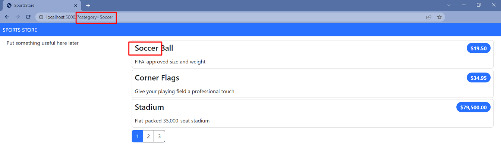

- To improve the URLs like `/?category=Soccer`, change the routing configuration in the `Program.cs` file. Create a more useful set of URLs. It is important to add the new routes in the order they are shown below.

```csharp
...

app.MapControllerRoute(
    name: "pagination",
    pattern: "Products/Page{productPage:int}",
    defaults: new { Controller = "Home", action = "Index", productPage = 1 });

// NEW: Add custom route for category pagination
app.MapControllerRoute(
     name: "categoryPage",
     pattern: "{category}/Page{productPage:int}",
     defaults: new { Controller = "Home", action = "Index" });
  
// NEW: Add custom route for category products
app.MapControllerRoute(
    name: "category",
    pattern: "Products/{category}",
    defaults: new { Controller = "Home", action = "Index", productPage = 1 });

// NEW: Add custom default route for home page
app.MapControllerRoute(
    name: "default",
    pattern: "/",
    defaults: new { Controller = "Home", action = "Index" });    

app.MapDefaultControllerRoute() 

SeedData.EnsurePopulated(app: app);

app.Run();
```

| URL | Route Name | Leads to |
| ------ | ------ | ------ |
| / | default | Shows the first page of products from all categories |
| /Products/Page2 | pagination | Shows the specified page (in this case, page 2), showing items from all categories |
| /Products/Soccer | category | Shows the first page of items from a specific category (in this case, the `Soccer` category) |
| /Soccer/Page1 | categoryPage | Shows the specified page (in this case, page 1) of items from the specified category (in this case, `Soccer`) |
| /Chess/Page1 | categoryPage | Shows the specified page (in this case, page 1) of items from the specified category (in this case, `Chess`) |

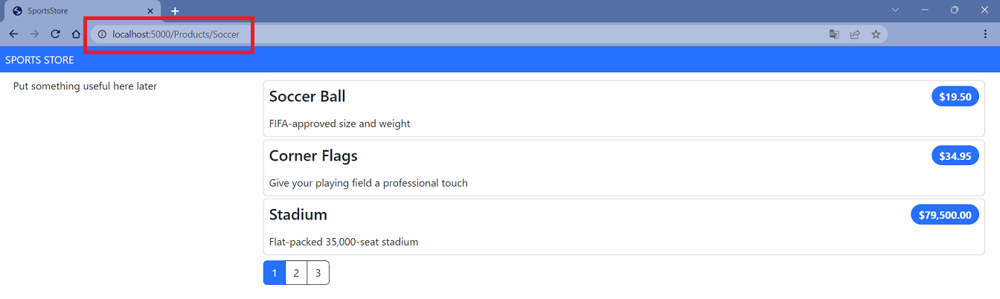

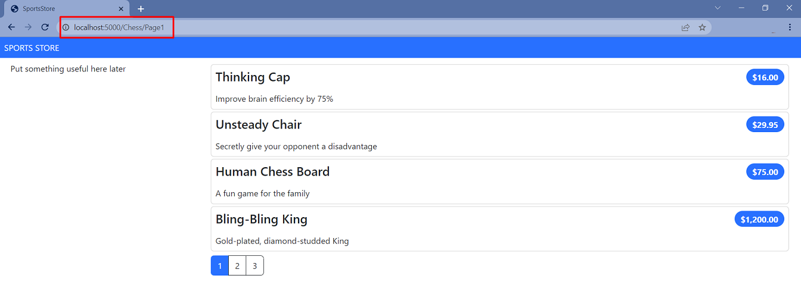
    
- To start generating more complex URLs, it's necessary to receive additional information from the view without having to add extra properties to the tag helper class. Add `Prefixed Values` in the `PageLinkTagHelper` to receive properties with a common prefix all together in a single collection.

```csharp
[HtmlTargetElement("div", Attributes = "page-model")]
public class PageLinkTagHelper : TagHelper 
{
    . . . 
    // NEW: Add PageRoute property for custom routing
    public string? PageRoute { get; set; }
    // NEW: Add HtmlAttributeName for tag helper attributes
    [HtmlAttributeName(DictionaryAttributePrefix = "page-url-")]
    // NEW: Add PageUrlValues dictionary for dynamic URL parameters
    public Dictionary<string, object> PageUrlValues { get; set; }  = new Dictionary<string, object>();
    . . .
    public override void Process(TagHelperContext context, TagHelperOutput output)
    {
        if (ViewContext != null && PageModel != null)
        {
            IUrlHelper urlHelper = urlHelperFactory.GetUrlHelper(ViewContext);
            TagBuilder result = new TagBuilder("div");
            for (int i = 1; i <= PageModel.TotalPages; i++)
            {
                TagBuilder tag = new TagBuilder("a");
                // NEW: Set productPage parameter in dictionary
                PageUrlValues[key: "productPage"] = i;
                // NEW: Generate action URL using Action helper
                tag.Attributes[key: "href"] = urlHelper.Action(action: PageAction, values: PageUrlValues);
                // NEW: Generate route URL using RouteUrl helper
                tag.Attributes[key: "href"] = urlHelper.RouteUrl(routeName: PageRoute, values: PageUrlValues);
                
                if (PageClassesEnabled)
                {
                    tag.AddCssClass(PageClass);
                    tag.AddCssClass(i == PageModel.CurrentPage ? PageClassSelected : PageClassNormal);
                }
                tag.InnerHtml.Append(i.ToString());
                result.InnerHtml.AppendHtml(tag);
            }
            output.Content.AppendHtml(result.InnerHtml);
        }
    }
   . . . 
}
```
- Add a new attribute to the `Index.cshtml` Razor View file in the `SportsStore/Views/Home` folder.

```html
  @model ProductsListViewModel
  
 <!-- NEW: Determine route name based on category selection -->
 @{
      var route = this.Model.CurrentCategory is null ? "pagination" : "categoryPage";
  }
  
  @foreach (var p in Model?.Products ?? Enumerable.Empty<Product>())
  {
      <partial name="_ProductSummary" model="p" />
  }

  <!-- NEW: Add pagination div with custom tag helper and category support -->
  <div page-model="@Model?.PagingInfo" page-classes-enabled="true" page-route="@route"
        page-class="btn" page-class-normal="btn-outline-dark"
        page-class-selected="btn-primary" page-url-category="@Model?.CurrentCategory!"
        class="btn-group pull-right m-1">
  </div>
```

- Restart ASP.NET Core and request http://localhost:5000/Soccer/Page1.

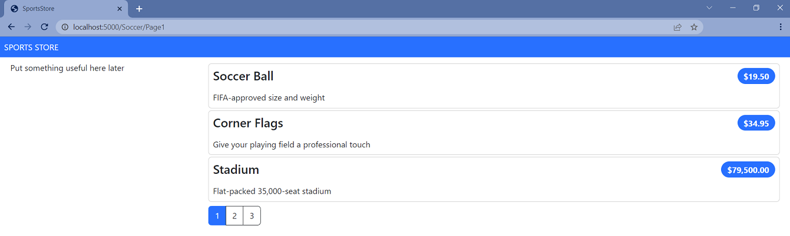

- Create a folder called `Components`, which is the conventional home of View Components, in the `SportsStore` project.

-  Add the `NavigationMenuViewComponent` class to it.

```csharp
using Microsoft.AspNetCore.Mvc;

namespace SportsStore.Components;

public class NavigationMenuViewComponent : ViewComponent
{
    // NEW: Add Invoke method for View Component
    public string Invoke()
    {
        return "Hello from the Navigation View Component";
    }
}
```

- To view the result of the `Invoke` method, open the `_Layout.cshtml` Layout Razor View file and add the tag `<vc:navigation-menu />` as shown below: 

```html
<!DOCTYPE html>
<html>
<head>
    <meta name="viewport" content="width=device-width" />
    <title>SportsStore</title>
    <link href="/lib/bootstrap/css/bootstrap.min.css" rel="stylesheet" />
</head>
<body>
    <div class="bg-primary text-white p-2">
        <span class="navbar-brand ml-2">SPORTS STORE</span>
    </div>
    <div class="row m-1 p-1">
        <div id="categories" class="col-3">
          <!-- NEW: Add navigation menu View Component -->
          <vc:navigation-menu />
        </div>
        <div class="col-9">
            @RenderBody()
        </div>
    </div>
</body>
</html>
```
    
- Restart ASP.NET Core and request http://localhost:5000.

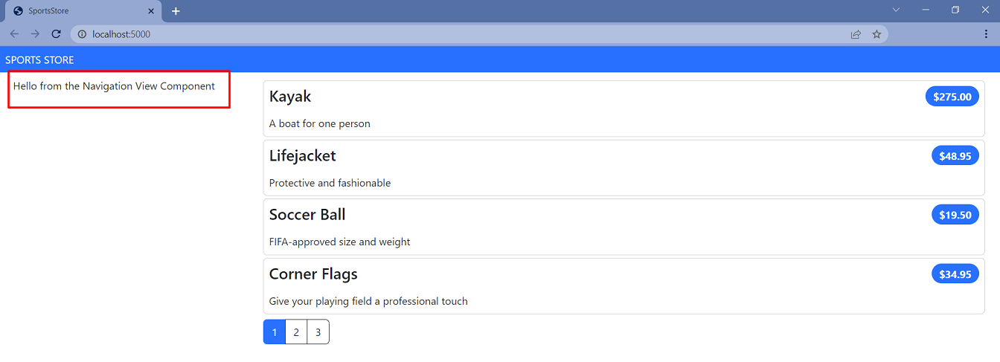

- Change the `NavigationMenuViewComponent` class by adding categories:

```csharp
using Microsoft.AspNetCore.Mvc;
using SportsStore.Models.Repository;

namespace SportsStore.Components;

public class NavigationMenuViewComponent : ViewComponent
{
    // NEW: Add repository dependency for data access
    private IStoreRepository repository;
    // NEW: Add constructor with dependency injection
    public NavigationMenuViewComponent(IStoreRepository repository)
    {
        this.repository = repository;
    }
    public IViewComponentResult Invoke()
    {
        // NEW: Return distinct categories using LINQ and ordered alphabetically
        return View(repository.Products
             .Select(x => x.Category)
             .Distinct()
             .OrderBy(x => x));
    }
} 
}
```

- Create the `Views/Shared/Components/NavigationMenu` folder in the `SportsStore` project and add to it to the `Default.cshtml` Razor View file.

```html
@model IEnumerable<string>

<div class="d-grid gap-2">
    <a class="btn btn-outline-secondary" asp-route="default">
        Home
    </a>
    @foreach (string category in Model ?? Enumerable.Empty<string>())
    {
        <a class="btn btn-outline-secondary"
        asp-route="category" asp-route-category="@category">
            @category
        </a>
    }
</div>
```

- Restart ASP.NET Core and request http://localhost:5000.

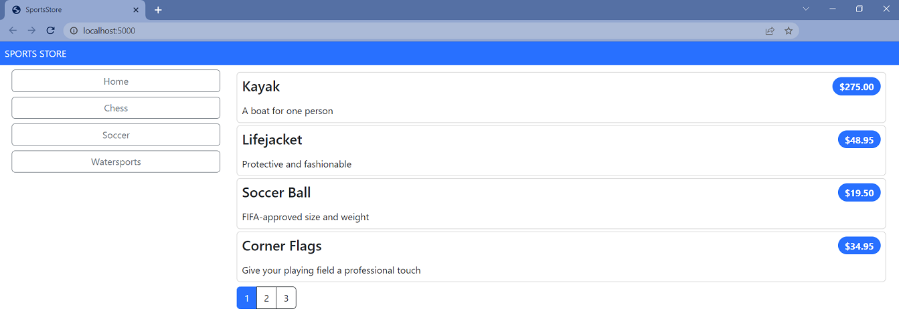

- Use the `RouteData` property in the `Invoke` method of `NavigationMenuViewComponent` to access the requested data in order to get the value for the currently selected category. 

```csharp
public class NavigationMenuViewComponent : ViewComponent 
{
        ...
        public IViewComponentResult Invoke() 
        {
            // NEW: Set selected category from route data using ViewBag
            ViewBag.SelectedCategory = RouteData?.Values["category"];
            ...
        }
        ...
    }
}
```

- To highlight the selected categories, change the `Default.cshtml` file.

```html
@model IEnumerable<string>

<div class="d-grid gap-2">
    <a class="btn btn-outline-secondary" asp-route="default">
        Home
    </a>
    @foreach (string category in Model ?? Enumerable.Empty<string>())
    {
        <a class="btn @(category == ViewBag.SelectedCategory ? "btn-primary": "btn-outline-secondary")"
           asp-route="category" asp-route-category="@category">
            @category
        </a>
    }
</div>
```

- Restart ASP.NET Core and request http://localhost:5000.

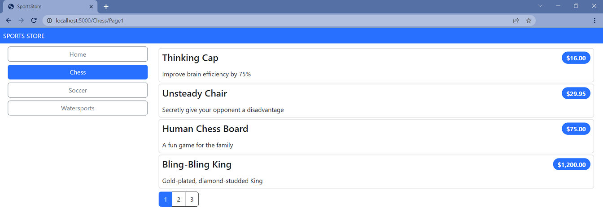

- Update the `Index` action method in the `Home` controller which will allow you to take into account the categories in the pagination (the functionality that breaks the selection result into pages). 

```csharp
public ViewResult Index(string? category, int productPage = 1)
    => View(new ProductsListViewModel
    {
        Products = repository.Products
        .Where(p => category == null || p.Category == category)
        .OrderBy(p => p.ProductId)
        .Skip((productPage - 1) * PageSize)
        .Take(PageSize),
        PagingInfo = new PagingInfo
        {
            CurrentPage = productPage,
            ItemsPerPage = PageSize,
            // NEW: Calculate total items using conditional LINQ query
            TotalItems = category == null ? repository.Products.Count() : repository.Products.Count(e => e.Category == category),
        },
        CurrentCategory = category,
    });
        
```
- Restart ASP.NET Core and request http://localhost:5000.

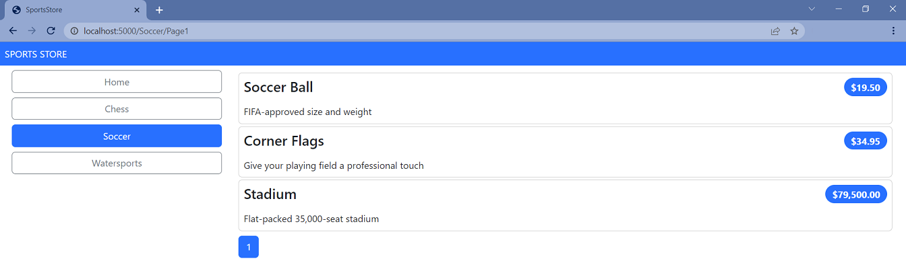

- Add and view changes and than commit.

```bash
$ git status
$ git add *.cs *.csproj *.cshtml
$ git diff --staged
$ git commit -m "feat: implement category navigation with View Components and improved routing"
```

</details>

<details>
<summary>

**Building the Shopping Cart**

</summary>

- Add a new `_CartLayout.cshtml` Layout Razor View file to the `SportsStore/Views/Shared` folder for the`Cart` views.

```html
<!DOCTYPE html>
<html lang="en">
<head>
    <meta name="viewport" content="width=device-width" />
    <title>SportsStore</title>
    <link href="/lib/bootstrap/css/bootstrap.min.css" rel="stylesheet" />
</head>
<body>
    <div class="bg-primary text-white p-2">
        <span class="navbar-brand ml-2">SPORTS STORE</span>
    </div>
    <div class="m-1 p-1">
        @RenderBody()
    </div>
</body>
</html>
```

- Add the `CartController.cs` class file to the `SportsStore/Controllers` folder.

```csharp
namespace SportsStore.Controllers;

public class CartController : Controller
{
    // NEW: Add Index action for cart display
    public IActionResult Index()
    {
        return View();
    }
}
```

- Add the `Index.cshtml` Razor View file to the `SportsStore/Views/Cart` folder.

```html
@{
    this.Layout = "_CartLayout";
}

<h4>This is the Cart View</h4>
```

- To improve the routing add new "shoppingCart" route to the routing configuration to the `Program.cs` file.

```csharp
  . . .
  
  app.MapControllerRoute(
      name: "pagination",
      pattern: "Products/Page{productPage:int}",
      defaults: new { Controller = "Home", action = "Index", productPage = 1 });
  
  app.MapControllerRoute(
      name: "categoryPage",
      pattern: "{category}/Page{productPage:int}",
      defaults: new { Controller = "Home", action = "Index" });

  app.MapControllerRoute(
      name: "category",
      pattern: "Products/{category}",
      defaults: new { Controller = "Home", action = "Index", productPage = 1 });
   
  // NEW: Add custom route for shopping cart
  app.MapControllerRoute(
      name: "shoppingCart",
      pattern: "Cart",
      defaults: new { Controller = "Cart", action = "Index" });
  
  app.MapControllerRoute(
      name: "default",
      pattern: "/",
      defaults: new { Controller = "Home", action = "Index" });   
  
  . . .
```

- Restart ASP.NET Core and request http://localhost:5000/Cart.

    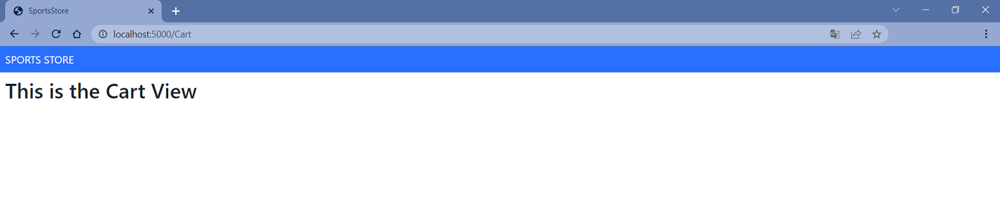

- To create the buttons that will add products to the cart, add the `UrlExtensions.cs` class file (in`Infrastructure` folder) and define the `PathAndQuery` extension method in the `UrlExtensions.cs` class.

```csharp
namespace SportsStore.Infrastructure;

// NEW: Add UrlExtensions class for HTTP request utilities
public static class UrlExtensions
{
    public static string PathAndQuery(this HttpRequest request)
        => request.QueryString.HasValue ? $"{request.Path}{request.QueryString}" : request.Path.ToString();
}
```
The extension method generates a URL. The browser will return to this URL after the cart has been updated. If there are `Query Parameters` in the URL, they should be considered as well.  

- Add a `SportsStore.Infrastructure` namespace to the` _ViewImports.cshtml` file in the `SportsStore/Views` folder.

```csharp
  @using SportsStore.Models
  @using SportsStore.Models.ViewModels
  // NEW: Add Infrastructure namespace for extension methods
  @using SportsStore.Infrastructure
  @addTagHelper *, Microsoft.AspNetCore.Mvc.TagHelpers
  @addTagHelper *, SportsStore
```

- Add the markup for the buttons into the `_ProductSummary.cshtml` Razor Partial View file in the `SportsStore/Views/Shared` folder.
        
```html
@model Product

<div class="card card-outline-primary m-1 p-1">
    <div class="bg-faded p-1">
        <h4>
            @Model?.Name
            <span class="badge rounded-pill bg-primary text-white"
                  style="float:right">
                <small>@Model?.Price.ToString("c")</small>
            </span>
        </h4>
    </div>
    <!-- NEW: Add HTML form with ASP.NET Core tag helpers -->
    <form id="@Model?.ProductId" asp-controller="Cart" asp-antiforgery="true">
        <input type="hidden" asp-for="ProductId" />
        <input type="hidden" name="returnUrl"
               value="@ViewContext.HttpContext.Request.PathAndQuery()" />
        <span class="card-text p-1">
            @Model?.Description
            <button type="submit"
                    class="btn btn-success btn-sm pull-right" style="float:right">
                Add To Cart
            </button>
        </span>
    </form>
</div>
```

- Use the session state mechanism to store information about a user’s cart. In order to do this, add services and middleware to the `Program.cs` file.

```csharp
  . . .
  
  var builder = WebApplication.CreateBuilder(args);
  
  builder.Services.AddControllersWithViews();
  
  builder.Services.AddDbContext<StoreDbContext>(opts => {
      opts.UseSqlServer(builder.Configuration["ConnectionStrings:SportsStoreConnection"]);
  });

  builder.Services.AddScoped<IStoreRepository, EFStoreRepository>();
  
  // NEW: Add distributed memory cache service for session storage
  builder.Services.AddDistributedMemoryCache();
  // NEW: Add session service for cart persistence
  builder.Services.AddSession();

  var app = builder.Build();
  
  app.UseStaticFiles();

    // NEW: Enable session middleware
  app.UseSession();

  . . .
  
  app.Run()
```

- To implement the cart feature, add the `Cart`class and the `CartLine` class (in files in the `Models` folder). 

```csharp
namespace SportsStore.Models

public class Cart
{
    // NEW: Add private fields and properties
    private List<CartLine> lines = new List<CartLine>();
    public IReadOnlyList<CartLine> Lines { get { return lines; } }
    public void AddItem(Product product, int quantity)
    {
        CartLine? line = lines.
            Where(p => p.Product.ProductId == product.ProductId)
            .FirstOrDefault();
        if (line is null)
        {
            lines.Add(new CartLine
            {
                Product = product,
                Quantity = quantity,
            });
        }
        else
        {
            line.Quantity += quantity;
        }
    }
    public void RemoveLine(Product product)
        => lines.RemoveAll(l => l.Product.ProductId == product.ProductId);
    public decimal ComputeTotalValue()
        => lines.Sum(e => e.Product.Price * e.Quantity);
    public void Clear() => lines.Clear();
}

// NEW: Add CartLine class for individual cart items
public class CartLine
{
    // NEW: Add CartLine properties
    public int CartLineId { get; set; }
    public Product Product { get; set; } = new();
    public int Quantity { get; set; }
}
```

The `Cart` class uses the `CartLine` class to represent a product selected by the customer and the quantity a user wants to buy. The `Cart` class includes the methods that add an item to the cart, remove a previously added item from the cart, calculate the total cost of the items in the cart, and reset the cart by removing all the items.

- To store a `Cart` object (the session state feature in ASP.NET Core stores only `int`, `string`, and `byte[]` values) define extension methods to the `ISession` interface that provides access to the session state data to serialize `Cart` objects into JSON and convert them back. Add the interface that provides access to the session state data to serialize `Cart` objects into JSON and convert them back. Add the `SessionExtensions.cs` class file to the `Infrastructure` folder and defined the extension methods. 

```csharp
using System.Text.Json;

namespace SportsStore.Infrastructure;

// NEW: Add SessionExtensions class for JSON serialization
public static class SessionExtensions
{
    public static void SetJson(this ISession session, string key, object value)
    {
        session.SetString(key, JsonSerializer.Serialize(value));
    }

    public static T? GetJson<T>(this ISession session, string key)
    {
        var sessionData = session.GetString(key);
        return sessionData == null ? default(T) : JsonSerializer.Deserialize<T>(sessionData);
    }
}
```

- Add the `CartViewModel.cs` class file to the `SportsStore/Models/ViewModels` folder.

```csharp
namespace SportsStore.Models.ViewModels;

// NEW: Add CartViewModel class for cart view data
public class CartViewModel
{
    // NEW: Add CartViewModel properties
    public Cart? Cart { get; set; } = new();
    public Uri ReturnUrl { get; set; } = new Uri("/", UriKind.Relative);
}

```

- Change the `CartController` class.

```csharp
namespace SportsStore.Controllers;

public class CartController(IStoreRepository repository) : Controller
{
    // NEW: Add repository dependency for cart operations
    private readonly IStoreRepository repository = repository ?? throw new ArgumentNullException(nameof(repository));

    // NEW: Add constructor with dependency injection

    [HttpGet]
    public IActionResult Index(string returnUrl)
    {
        // NEW: Return CartViewModel with session data
        return this.View(new CartViewModel
        {
            ReturnUrl = new Uri(returnUrl ?? "/"),
            Cart = this.HttpContext.Session.GetJson<Cart>("cart") ?? new Cart(),
        });
    }

    [HttpPost]
    // NEW: Add POST action for adding items to cart
    public IActionResult Index(long productId, Uri returnUrl)
    {
        Product? product = this.repository.Products.FirstOrDefault(p => p.ProductId == productId);

        if (product != null)
        {
            var cart = this.HttpContext.Session.GetJson<Cart>("cart") ?? new Cart();
            cart.AddItem(product, 1);
            this.HttpContext.Session.SetJson("cart", cart);
            return this.View(new CartViewModel { Cart = cart, ReturnUrl = returnUrl ?? new Uri("/") });
        }

        return this.RedirectToAction("Index", "Home");
    }
}

```
- Change the `Index.cshtml` Razor View file in the `SportsStore/Views/Cart` folder.

```html
<!-- NEW: Set model for cart view -->
  @model CartViewModel
  
  @{
      this.Layout = "_CartLayout";
  }
  
  <!-- NEW: Add cart header -->
  <h2>Your cart</h2>
  <table class="table table-bordered table-striped">
    <thead>
        <tr>
            <th>Quantity</th>
            <th>Item</th>
            <th class="text-right">Price</th>
            <th class="text-right">Subtotal</th>
        </tr>
    </thead>
    <tbody>
        @foreach (var line in Model?.Cart?.Lines ?? Enumerable.Empty<CartLine>())
        {
            <tr>
                <td class="text-center">@line.Quantity</td>
                <td class="text-left">@line.Product.Name</td>
                <td class="text-right">@line.Product.Price.ToString("c")</td>
                <td class="text-right">
                    @((line.Quantity * line.Product.Price).ToString("c"))
                </td>
            </tr>
        }
    </tbody>
    <tfoot>
        <tr>
            <td colspan="3" class="text-right">Total:</td>
            <td class="text-right">
                @Model?.Cart?.ComputeTotalValue().ToString("c")
            </td>
        </tr>
    </tfoot>
  </table>
  <div class="text-center">
      <a class="btn btn-primary" href="@Model?.ReturnUrl">Continue shopping</a>
  </div>

```
- Restart ASP.NET Core and request http://localhost:5000. As a result, the basic functions of the shopping cart should be in place. First, products are listed along with the button that adds them to the cart. You can see that by restarting ASP.NET Core and requesting http://localhost:5000.  

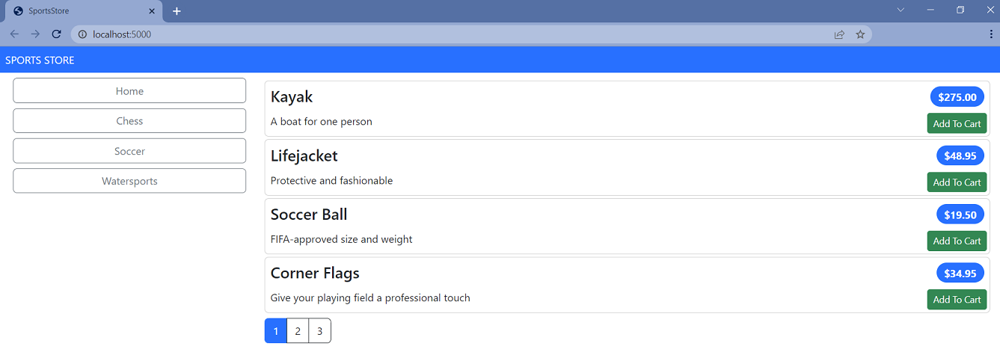

Then, when the user clicks the `Add To Cart` button, the selected product is added to their cart and the summary of the cart is displayed, as shown below
    
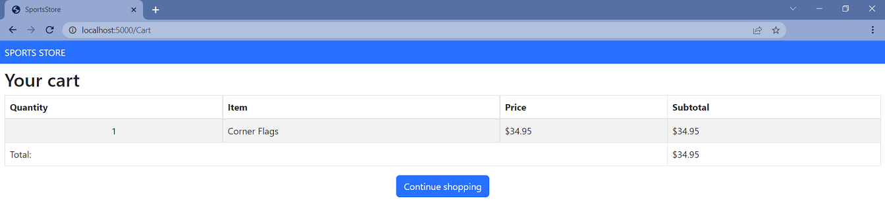

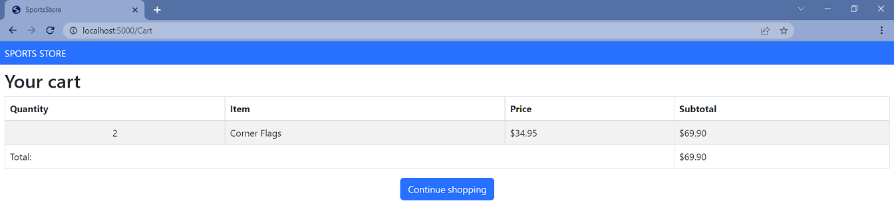

Clicking the `Continue Shopping button` returns the user to the product page they came from.

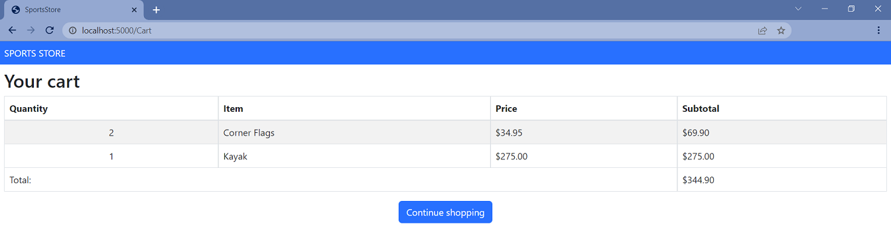

- Add and view changes and than commit.

```bash
$ git status
$ git add *.cs *.csproj *.cshtml
$ git diff --staged
$ git commit -m "feat: implement shopping cart with session storage and cart management"
```

- Push the local branch to the remote branch.

```bash
$ git push --set-upstream origin step-3

```
- Switch to the `main` branch and do a merge according to changes from the `step-3` branch.

```bash
$ git checkout main

$ git merge step-3
```
- Push the changes from the local `main` branch to the remote branch.

```bash
$ git push

```
- Go to the `Sports Store Application - Step 4` (branch `step-4`).

</details>

## Additional Materials

**Note:** The following links were verified as of .NET 8 release. For the most up-to-date information, always check the official Microsoft documentation.

<details><summary>References
</summary> 

1. [Minimal APIs overview](https://docs.microsoft.com/en-us/aspnet/core/fundamentals/minimal-apis?view=aspnetcore-8.0)
1. [Get started with ASP.NET Core MVC](https://docs.microsoft.com/en-us/aspnet/core/tutorials/first-mvc-app/start-mvc?view=aspnetcore-8.0&tabs=visual-studio)
1. [Controllers](https://jakeydocs.readthedocs.io/en/latest/mvc/controllers/index.html)
1. [Views](https://jakeydocs.readthedocs.io/en/latest/mvc/views/index.html)
1. [Models](https://jakeydocs.readthedocs.io/en/latest/mvc/models/index.html)
1. [ASP.NET Core MVC with EF Core - tutorial series](https://docs.microsoft.com/en-us/aspnet/core/data/ef-mvc/?view=aspnetcore-8.0)
1. [Persist and retrieve relational data with Entity Framework Core](https://docs.microsoft.com/en-us/learn/modules/persist-data-ef-core/?view=aspnetcore-8.0)

</details>

<details><summary>[Adam Freeman: Pro ASP.NET Core 7, Tenth Edition](https://www.amazon.com/Pro-ASP-NET-Core-7-Tenth/dp/1633437825)</summary>

1. Part Ⅰ. Chapter 8. SportsStore: Navigation and Cart.
1. Part Ⅱ. Chapter 13. Using URL Routing.
1. Part Ⅱ. Chapter 16. Using the Platform Features, Part 2.
1. Part Ⅲ. Chapter 18. Creating the Example Project.
1. Part Ⅲ. Chapter 21. Using Controllers with Views. Part 1.
1. Part Ⅲ. Chapter 22. Using Controllers with Views. Part 2.
1. Part Ⅲ. Chapter 23. Using Razor Pages.
1. Part Ⅲ. Chapter 24. Using View Components.
1. Part Ⅲ. Chapter 25. Using Tag Helpers.

</details>
