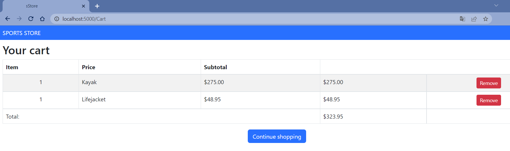
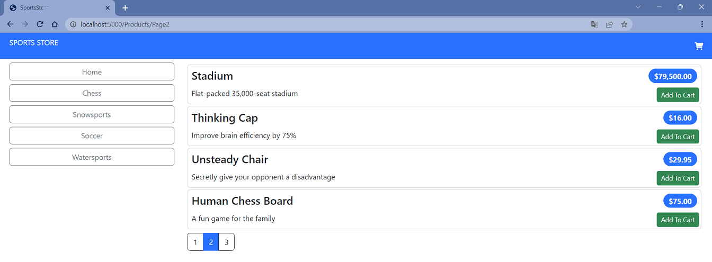
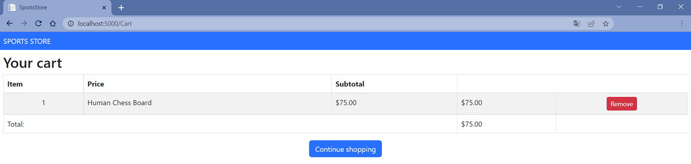
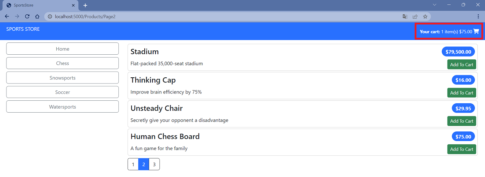
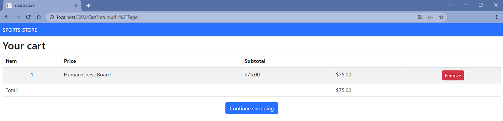
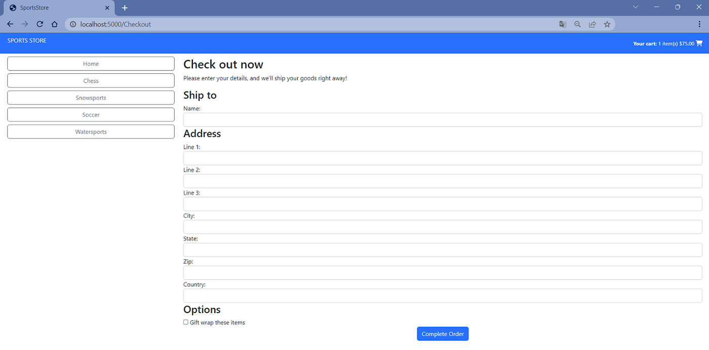
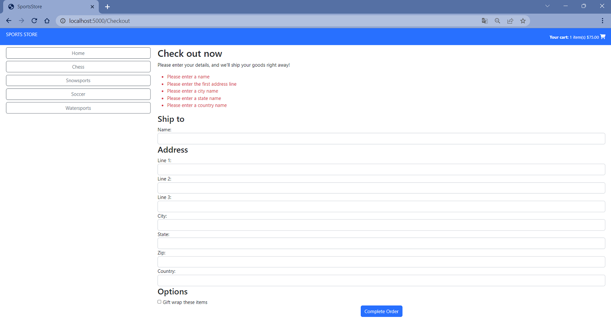
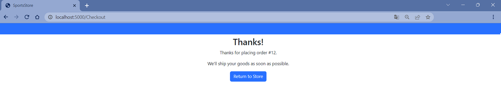

# Sports Store Application. Step 4

## Description

Complete shopping cart development with a simple checkout process. This step focuses on implementing session-based cart functionality, order processing, and completing the e-commerce workflow.

## Implementation details

<details>
<summary>

**Refining the Cart Model with a Service**
</summary>

- Go to the cloned repository from the previous step `Sports Store Application. Step 3`. 

- Switch to the `step-4` branch and perform a fast-forward merge with the `main` branch:

```git
$ git checkout step-4

$ git merge main --ff

```

- Continue your work in Visual Studio or another IDE.

- Build the project, run the application, and navigate to http://localhost:5000/. All functionality implemented in the previous step should work correctly.

- To enable method overriding in derived classes, apply the `virtual` keyword to the `AddItem`, `RemoveLine`, and `Clear` methods of the `Cart` class. This allows the `SessionCart` class to override these methods and add session persistence functionality:

```csharp
using System.Text.Json;
using System.Text.Json.Serialization;

namespace SportsStore.Models;

public class Cart
{
    // ... existing code ...
    // NEW: Add virtual keyword to enable method overriding
    public virtual void AddItem(Product product, int quantity)
    {
        // ... existing implementation ...
    }
    // NEW: Add virtual keyword to enable method overriding
    public virtual void RemoveLine(Product product)
    {
        // ... existing implementation ...
    }
    // NEW: Add virtual keyword to enable method overriding
    public virtual void Clear()
    {
        // ... existing implementation ...
    }
}
```

- Create a `SessionCart` class in the `SessionCart.cs` file within the `Models` folder. This class extends the base `Cart` class and adds session persistence capabilities:

```csharp
using System.Text.Json;
using System.Text.Json.Serialization;

namespace SportsStore.Models;

// NEW: Create SessionCart class that extends Cart with session persistence
public class SessionCart : Cart
{
    public static Cart GetCart(IServiceProvider services)
    {
        ISession? session = services.GetRequiredService<IHttpContextAccessor>().HttpContext?.Session;

        SessionCart cart = new SessionCart
        {
            Session = session
        };

        // Load cart data from session
        var cartData = session?.GetString("Cart");
        if (!string.IsNullOrEmpty(cartData))
        {
            var deserializedLines = JsonSerializer.Deserialize<List<CartLine>>(cartData);
            if (deserializedLines != null)
            {
                // Load lines directly without triggering SaveCart
                cart.LoadLines(deserializedLines);
            }
        }

        return cart;
    }

    [JsonIgnore]
    public new ISession? Session { get; set; }

    public override void AddItem(Product product, int quantity)
    {
        base.AddItem(product, quantity);
        this.SaveCart();
    }

    public override void RemoveLine(Product product)
    {
        base.RemoveLine(product);
        this.SaveCart();
    }

    public override void Clear()
    {
        base.Clear();
        this.Session?.Remove("Cart");
    }

    private void SaveCart()
    {
        if (this.Session != null)
        {
            var cartData = JsonSerializer.Serialize(this.Lines);
            this.Session.SetString("Cart", cartData);
        }
    }

    private void LoadLines(List<CartLine> lines)
    {
        this.Lines.Clear();
        foreach (var line in lines)
        {
            this.Lines.Add(line);
        }
    }
}        
```

- Register the cart service in the `Program.cs` file. This enables dependency injection for the cart and session management:

```csharp
// ... existing code ...

builder.Services.AddSession();
// NEW: Register Cart service with dependency injection
builder.Services.AddScoped<Cart>(SessionCart.GetCart);
// NEW: Register HttpContextAccessor for session access
builder.Services.AddSingleton<IHttpContextAccessor, HttpContextAccessor>();

// ... existing code ...
```

- Simplify the `CartController` class by using dependency injection for the `Cart` object:

```csharp
using Microsoft.AspNetCore.Mvc;
using SportsStore.Models;
using SportsStore.Models.Repository;
using SportsStore.Models.ViewModels;

namespace SportsStore.Controllers;

public class CartController(IStoreRepository repository, Cart cart) : Controller
{
    private IStoreRepository repository = repository ?? throw new ArgumentNullException(nameof(repository));

    // NEW: Inject Cart dependency through constructor

    // NEW: Add Cart property for dependency injection
    public Cart Cart { get; set; } = cart ?? throw new ArgumentNullException(nameof(cart));

    [HttpGet]
    public IActionResult Index(string returnUrl)
    {
        return this.View(new CartViewModel
        {
            ReturnUrl = returnUrl ?? "Home",
            Cart = this.Cart
        });
    }

    [HttpPost]
    // NEW: Handle POST request to add items to cart
    public IActionResult Index(long productId, string returnUrl)
    {
        Product? product = this.repository.Products.FirstOrDefault(p => p.ProductId == productId);

        if (product != null)
        {
            this.Cart.AddItem(product, 1);

            return this.View(new CartViewModel 
            {
                Cart = this.Cart, 
                ReturnUrl = returnUrl ?? "Home"
            });
        }

        return this.RedirectToAction("Index", "Home");
    }

    [HttpPost]
    [Route("Cart/Remove")]
    // NEW: Add Remove action method for cart items
    public IActionResult Remove(long productId, string returnUrl)
    {
        var lineToRemove = this.Cart.Lines.FirstOrDefault(cl => cl.Product.ProductId == productId);
        if (lineToRemove != null)
        {
            this.Cart.RemoveLine(lineToRemove.Product);
        }
        
        return this.View("Index", new CartViewModel
        {
            Cart = this.Cart,
            ReturnUrl = returnUrl ?? "Home"
        });
    }
}
```

- Restart ASP.NET Core and navigate to http://localhost:5000/.


- Add and view changes, then commit:

```git
$ git status
$ git add *.cs *.csproj *.cshtml
$ git diff --staged
$ git commit -m "feat(cart): implement session persistence and dependency injection"
```

</details>

<details>
<summary>

**Completing the Cart Functionality**
</summary>

- To enable item removal from the cart, add a `Remove` button to the `Index.cshtml` Razor View file in the `SportsStore/Views/Cart` folder. This button will submit an HTTP POST request:

```html
// ... existing code ...
@foreach (var line in Model.Cart.Lines)
{
    <tr>
        // ... existing code ...
        <td class="text-right">
            @((line.Quantity * line.Product.Price).ToString("c"))
        </td>
        <!-- NEW: Add Remove button column for cart items -->
        <td class="text-center">
            <form method="post" asp-action="Remove" asp-controller="Cart">
                <input type="hidden" name="ProductID" value="@line.Product.ProductId"/>
                <input type="hidden" name="returnUrl" value="@Model?.ReturnUrl"/>
                <button type="submit" class="btn btn-sm btn-danger">
                    Remove
                </button>
            </form>
        </td>
    </tr>
}
// ... existing code ...
```

- Add a `Remove` action method to the `CartController` class:

```csharp
using Microsoft.AspNetCore.Mvc;
using SportsStore.Infrastructure;
using SportsStore.Models;
using SportsStore.Models.Repository;
using SportsStore.Models.ViewModels;

namespace SportsStore.Controllers;

public class CartController : Controller
{
    // ... existing code ...
    [HttpPost]
    [Route("Cart/Remove")]
    // NEW: Add Remove action method for cart items
    public IActionResult Remove(long productId, string returnUrl)
    {
        Cart.RemoveLine(Cart.Lines.First(cl => cl.Product.ProductId == productId).Product);
        return View("Index", new CartViewModel
        {
            Cart = Cart,
            ReturnUrl = returnUrl ?? "/"
        });
    }
    // ... existing code ...
}
```

- Add a new `remove` route to the `Program.cs` file:

```csharp
// ... existing code ...

app.MapControllerRoute(
    "default",
    "/",
    new { Controller = "Home", action = "Index" });

// NEW: Add remove route for cart functionality
app.MapControllerRoute(
    "remove",
    "Remove",
    new { Controller = "Cart", action = "Remove" });

// ... existing code ...
```

- Restart ASP.NET Core and navigate to http://localhost:5000/Cart



- Add a cart summary widget that displays throughout the application and can be clicked to view cart contents. Use the `Font Awesome` package, which provides excellent open-source icons integrated as fonts (see http://fortawesome.github.io/Font-Awesome). To install the client-side package, use a PowerShell command prompt or Visual Studio's LibMan features:

```
libman install font-awesome@6.5.0 -d wwwroot/lib/font-awesome

```

The `libman.json` file should look like this (always check for up-to-date library versions):

**Important:** The versions shown below are current as of 2024. Always verify the latest stable versions before implementing in production projects.

```json
{
  "version": "1.0",
  "defaultProvider": "cdnjs",
  "libraries": [
    {
      "library": "bootstrap@5.3.2",
      "destination": "wwwroot/lib/bootstrap"
    },
    {
      "provider": "cdnjs",
      "library": "font-awesome@6.5.0",
      "destination": "wwwroot/lib/font-awesome/"
    }
  ]
}
```

- Create a `CartSummaryViewComponent` class in the `CartSummaryViewComponent.cs` file within the `Components` folder:

```csharp
namespace SportsStore.Components;

// NEW: Create CartSummary ViewComponent for cart display
public class CartSummaryViewComponent : ViewComponent
{
    private Cart cart;
    public CartSummaryViewComponent(Cart cart)
    {
        this.cart = cart;
    }
    public IViewComponentResult Invoke()
    {
        return View(cart);
    }
}

```

- Create the `Views/Shared/Components/CartSummary` folder and add a View Component named `Default.cshtml` with the following content:

```html
@model Cart

<div class="">
    @if (Model.Lines.Any())
    {
        <small class="navbar-text">
            <b>Your cart:</b>
            @Model?.Lines.Sum(x => x.Quantity) item(s)
            @Model?.ComputeTotalValue().ToString("c")
        </small>
    }
    <a asp-route="shoppingCart"
       asp-route-returnurl="@ViewContext.HttpContext.Request.PathAndQuery()">
        <i class="fa fa-shopping-cart"></i>
    </a>
</div>
```

- To display the cart summary widget with a Font Awesome cart icon and cart details, add the `Cart Summary` component to the `_Layout.cshtml` file in the `Views/Shared` folder:

```html
<!DOCTYPE html>
<html>
<head>
    <meta name="viewport" content="width=device-width" />
    <title>SportsStore</title>
    <link href="/lib/bootstrap/css/bootstrap.min.css" rel="stylesheet" />
    <link href="/lib/font-awesome/css/all.min.css" rel="stylesheet" />
</head>
<body>
    <div class="bg-primary text-white p-2">
        <div class="container-fluid">
            <div class="row">
                <div class="col navbar-brand">SPORTS STORE</div>
                <div class="col-6 navbar-text text-end">
                    <!-- NEW: Add cart summary component to layout -->
                    <vc:cart-summary />
                </div>
            </div>
        </div>
    </div>
    <div class="row m-1 p-1">
        <div id="categories" class="col-3">
            <vc:navigation-menu />
        </div>
        <div class="col-9">
            @RenderBody()
        </div>
    </div>
</body>
</html>
```

- Restart ASP.NET Core and navigate to http://localhost:5000/Products/Page2. 

Add `Human Chess Board`.



Click the `Continue shopping` button.



The cart summary widget displays like this:



If you click the cart icon, you will see detailed cart contents:



- Add and view changes, then commit:

```git
$ git status
$ git add *.cs *.cshtml *.json *.csproj
$ git diff --staged
$ git commit -m "feat(cart): add item removal and summary widget"
```
</details>

<details>
<summary>

**Submitting Orders**
</summary>

- To represent customer shipping details, create an `Order.cs` class file in the `Models` folder:

```csharp
using System.ComponentModel.DataAnnotations;
using Microsoft.AspNetCore.Mvc.ModelBinding;

namespace SportsStore.Models;

// NEW: Create Order model for customer shipping details
public class Order
{
    [BindNever]
    public int OrderId { get; set; }

    [BindNever]
    public ICollection<CartLine> Lines { get; set; } = new List<CartLine>();

    [Required(ErrorMessage = "Please enter a name")]
    public string? Name { get; set; }

    [Required(ErrorMessage = "Please enter the first address line")]
    public string? Line1 { get; set; }

    public string? Line2 { get; set; }

    public string? Line3 { get; set; }

    [Required(ErrorMessage = "Please enter a city name")]
    public string? City { get; set; }

    [Required(ErrorMessage = "Please enter a state name")]
    public string? State { get; set; }

    public string? Zip { get; set; }

    [Required(ErrorMessage = "Please enter a country name")]
    public string? Country { get; set; }

    public bool GiftWrap { get; set; }

    // NEW: Add method to set cart lines for order processing
    public void SetLines(IEnumerable<CartLine> lines)
    {
        this.Lines.Clear();
        foreach (var line in lines)
        {
            this.Lines.Add(line);
        }
    }
}

```

- Add a `Checkout` button to the cart view in the `Index.cshtml` file within the `SportsStore/Views/Cart` folder:

```html
@model CartViewModel

@{
    Layout = "_CartLayout";
}

<h2>Your cart</h2>
<table class="table table-bordered table-striped">
    // ... existing code ...
</table>
<div class="text-center">
    <a class="btn btn-primary" href="@Model.ReturnUrl">Continue shopping</a>
    <!-- NEW: Add Checkout button to cart view -->
    <a class="btn btn-primary" asp-route="checkout">Checkout</a>
</div>
```

- Create an `OrderController` class with a `Checkout` action method in the `OrderController.cs` file within the `Controllers` folder:

```csharp
using Microsoft.AspNetCore.Mvc;
using SportsStore.Models;
using SportsStore.Models.Repository;

namespace SportsStore.Controllers;

// NEW: Create OrderController for checkout process
public class OrderController : Controller
{
    public ViewResult Checkout() => View(new Order());
}
```

- Create the `Views/Order` folder and add a Razor View called `Checkout.cshtml`:

```html   
@model Order

<h2>Check out now</h2>
<p>Please enter your details, and we'll ship your goods right away!</p>
<form asp-action="Checkout" method="post">
    <h3>Ship to</h3>
    <div class="form-group">
        <label>Name:</label><input asp-for="Name" class="form-control" />
    </div>
    <h3>Address</h3>
    <div class="form-group">
        <label>Line 1:</label><input asp-for="Line1" class="form-control" />
    </div>
    <div class="form-group">
        <label>Line 2:</label><input asp-for="Line2" class="form-control" />
    </div>
    <div class="form-group">
        <label>Line 3:</label><input asp-for="Line3" class="form-control" />
    </div>
    <div class="form-group">
        <label>City:</label><input asp-for="City" class="form-control" />
    </div>
    <div class="form-group">
        <label>State:</label><input asp-for="State" class="form-control" />
    </div>
    <div class="form-group">
        <label>Zip:</label><input asp-for="Zip" class="form-control" />
    </div>
    <div class="form-group">
        <label>Country:</label><input asp-for="Country" class="form-control" />
    </div>
    <h3>Options</h3>
    <div class="checkbox">
        <label>
            <input asp-for="GiftWrap" /> Gift wrap these items
        </label>
    </div>
    <div class="text-center">
        <input class="btn btn-primary" type="submit" value="Complete Order" />
    </div>
</form>
```

- Add the `checkout` route to the `Program.cs` file:

```csharp
// ... existing code ...
app.MapControllerRoute(
    "default",
    "/",
    new { Controller = "Home", action = "Index" });

// NEW: Add checkout route for order processing
app.MapControllerRoute(
    "checkout",
    "Checkout",
    new { Controller = "Order", action = "Checkout" });

app.MapControllerRoute(
    "remove",
    "Remove",
    new { Controller = "Cart", action = "Remove" });
// ... existing code ...
```
    
- Restart ASP.NET Core and navigate to http://localhost:5000/Checkout.



- Add and view changes, then commit:

```git
$ git status
$ git add *.cs *.cshtml
$ git diff --staged
$ git commit -m "Submitting Orders"
```
</details>

<details>
<summary>

**Implementing Order Processing**
</summary>

- Add a new `Orders` property to the `StoreDbContext` database context class:

```csharp
namespace SportsStore.Models;

public class StoreDbContext : DbContext
{
    public StoreDbContext(DbContextOptions<StoreDbContext> options)
        : base(options) { }
    public DbSet<Product> Products => this.Set<Product>();
    // NEW: Add Orders DbSet for database storage
    public DbSet<Order> Orders => Set<Order>();
}
```

- To create the database migration, use a PowerShell command prompt to run the command:

```git
dotnet ef migrations add Orders

```

*This migration will be applied automatically when the application starts because the `SeedData` calls the `Migrate` method provided by Entity Framework Core.*

- Follow the same repository pattern used for the `Product` repository to provide access to `Order` objects. Create an `IOrderRepository.cs` interface file in the `Models/Repository` folder:

```csharp
namespace SportsStore.Models.Repository;

// NEW: Create IOrderRepository interface for order operations
public interface IOrderRepository
{
    IQueryable<Order> Orders { get; }
    void SaveOrder(Order order);
}
```

- To implement the order repository interface, create an `EFOrderRepository` class in the `EFOrderRepository.cs` file within the `Models/Repository` folder:

```csharp
using Microsoft.EntityFrameworkCore;

namespace SportsStore.Models.Repository;

// NEW: Create EFOrderRepository implementation for Entity Framework
public class EFOrderRepository : IOrderRepository
{
    private StoreDbContext context;
    public EFOrderRepository(StoreDbContext context)
    {
        this.context = context;
    }
    public IQueryable<Order> Orders => context.Orders
        .Include(o => o.Lines)
        .ThenInclude(l => l.Product);
    public void SaveOrder(Order order)
    {
        context.AttachRange(order.Lines.Select(l => l.Product));
        if (order.OrderId == 0)
        {
            context.Orders.Add(order);
        }
        context.SaveChanges();
    }
}
```

This class implements the `IOrderRepository` interface using Entity Framework Core, allowing stored `Order` objects to be retrieved and orders to be created or modified.

- Register the `Order Repository Service` in the `Program.cs` file:

```csharp
// ... existing code ...
builder.Services.AddScoped<IStoreRepository, EFStoreRepository>();
// NEW: Register Order repository service for dependency injection
builder.Services.AddScoped<IOrderRepository, EFOrderRepository>();
builder.Services.AddDistributedMemoryCache();
builder.Services.AddSession();
// ... existing code ...
```

- To complete the `OrderController` class, modify the constructor to receive required services and add an action method to handle HTTP form POST requests when users click the `Complete Order` button:

```csharp
using Microsoft.AspNetCore.Mvc;
using SportsStore.Models;
using SportsStore.Models.Repository;

namespace SportsStore.Controllers;

public class OrderController : Controller
{
    // NEW: Add order repository dependency
    private IOrderRepository orderRepository;
    // NEW: Add cart dependency for order processing
    private Cart cart;
    // NEW: Inject dependencies through constructor
    public OrderController(IOrderRepository orderRepository, Cart cart)
    {
        this.orderRepository = orderRepository;
        this.cart = cart;
    }
    // NEW: Keep existing Checkout GET method
    public ViewResult Checkout() => View(new Order());
    [HttpPost]
    // NEW: Add POST Checkout method for order processing
    public IActionResult Checkout(Order order)
    {
        if (!cart.Lines.Any())
        {
            ModelState.AddModelError("", "Sorry, your cart is empty!");
        }
        if (ModelState.IsValid)
        {
            order.SetLines(cart.Lines);
            orderRepository.SaveOrder(order);
            cart.Clear();
            return View("Completed", order.OrderId);
        }
        
        return View();
    }
}
```

- Add a validation summary to the `Checkout.cshtml` Razor View file:

```html
@model Order

<h2>Check out now</h2>
<p>Please enter your details, and we'll ship your goods right away!</p>
<!-- NEW: Add validation summary for form errors -->
<div asp-validation-summary="All" class="text-danger"></div>
<form asp-action="Checkout" method="post">
    // ... existing code ...
</form>
```

- Restart ASP.NET Core and navigate to http://localhost:5000/Checkout.



- To complete the checkout process, create a `Completed.cshtml` Razor View that displays a thank-you message with order summary:

```html
@model int

@{
    this.Layout = "_CartLayout";
}

<div class="text-center">
    <h2>Thanks!</h2>
    <p>Thanks for placing order #@Model.</p>
    <p>We'll ship your goods as soon as possible.</p>
    <a class="btn btn-primary" asp-route="default">Return to Store</a>
</div>
```
and `Checkout` action method to the `OrderController` class.

```csharp
using Microsoft.AspNetCore.Mvc;
using SportsStore.Models;
using SportsStore.Models.Repository;

namespace SportsStore.Controllers;

public class OrderController : Controller
{
    private IOrderRepository orderRepository;
    private Cart cart;
    public OrderController(IOrderRepository orderRepository, Cart cart)
    {
        this.orderRepository = orderRepository;
        this.cart = cart;
    }
    public ViewResult Checkout() => View(model: new Order());
    [HttpPost]
    // NEW: Implement POST Checkout method with order processing
    public IActionResult Checkout(Order order)
    {
        if (!cart.Lines.Any())
        {
            ModelState.AddModelError(key: string.Empty, errorMessage: "Sorry, your cart is empty!");
        }
        if (ModelState.IsValid)
        {
            order.SetLines(cart.Lines);
            orderRepository.SaveOrder(order: order);
            cart.Clear();
            return View(viewName: "Completed", model: order.OrderId);
        }
        return View();
    }
}

```

- Restart ASP.NET Core and request http://localhost:5000/Checkout. 



- Add and view changes, then commit:

```git
$ git status
$ git add *.cs *.csproj *.cshtml
$ git diff --staged
$ git commit -m "feat(orders): implement complete order processing"
```

- Push the local branch to the remote branch:

```git
$ git push --set-upstream origin sports-store-application-3

```

- Switch to the `main` branch and merge changes from the `sports-store-application-3` branch:

```git
$ git checkout main

$ git merge sports-store-application-3
```

- Push the changes from the local `main` branch to the remote branch:

```git
$ git push

```

- Proceed to the next step: `Sports Store Application. Step 5` (branch `step-5`).

</details>

## Additional Materials

<details><summary>References</summary> 

1. [Minimal APIs overview](https://docs.microsoft.com/en-us/aspnet/core/fundamentals/minimal-apis?view=aspnetcore-6.0)
2. [Get started with ASP.NET Core MVC](https://docs.microsoft.com/en-us/aspnet/core/tutorials/first-mvc-app/start-mvc?view=aspnetcore-6.0&tabs=visual-studio)
3. [Controllers](https://jakeydocs.readthedocs.io/en/latest/mvc/controllers/index.html)
4. [Views](https://jakeydocs.readthedocs.io/en/latest/mvc/views/index.html)
5. [Models](https://jakeydocs.readthedocs.io/en/latest/mvc/models/index.html)
6. [ASP.NET Core MVC with EF Core - tutorial series](https://docs.microsoft.com/en-us/aspnet/core/data/ef-mvc/?view=aspnetcore-6.0)
7. [Persist and retrieve relational data with Entity Framework Core](https://docs.microsoft.com/en-us/learn/modules/persist-data-ef-core/?view=aspnetcore-6.0)

</details>

<details><summary>[Adam Freeman: Pro ASP.NET Core 7, Tenth Edition](https://www.amazon.com/Pro-ASP-NET-Core-7-Tenth/dp/1633437825).</summary>

1. Part Ⅰ. Chapter 9. SportsStore: Completing the Cart.
2. Part Ⅱ. Chapter 13. Using URL Routing.
3. Part Ⅱ. Chapter 14. Using Dependency Injection.
4. Part Ⅱ. Chapter 15. Using the Platform Features. Part 1.
5. Part Ⅱ. Chapter 16. Using the Platform Features. Part 2.
6. Part Ⅱ. Chapter 17. Working with Data.
7. Part Ⅲ. Chapter 21. Using Controllers with Views. Part 1.
8. Part Ⅲ. Chapter 22. Using Controllers with Views. Part 2.
9. Part Ⅲ. Chapter 24. Using View Components.
10. Part Ⅲ. Chapter 28. Using Model Binding.
11. Part Ⅲ. Chapter 29. Using Model Validation.

</details>
